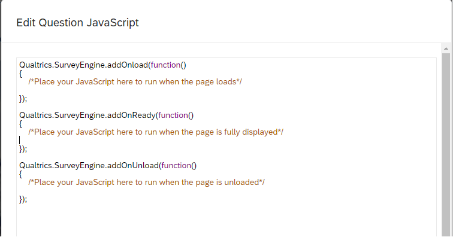

```{r setup, include=FALSE}
knitr::opts_chunk$set(echo = TRUE)
knitr::knit_engines$set("js")
```

# Introduction {.unnumbered}

```{r introVid, echo=FALSE}
vembedr::embed_url("https://youtu.be/zTW5Eltq22I")
```

Qualtrics offers out-of-the box survey capabilities and is paid for by the University. It’s easier to get survey data from online panels (MTurk, Prolific, Cloud Research) with software such as Qualtrics or Pavlovia instead of recruiting in-person.

Today, we are going to build a few workflows using Qualtrics and see how javascript can be used to customize options beyond vanilla Qualtrics. You will leave with some sample code to perform the following functions inside Qualtrics:  

1. Randomize order of stimuli across conditions
2. Hide the next button for a stipulated period of time
3. Play videos in Qualtrics and set options to autoplay, loop, hide controls
4. Customize question text
5. Learn where to look for solutions to questions you may have

Hopefully at the end of today we are comfortable enough to do more (customize options based on randomized order and previous answer, implement swipe actions for mobile devices) and implement more within-subjects designs in your online panel studies.

What today will not do:  

1. Make you an expert in JavaScript
2. Make you love JavaScript ('tis a silly language)

## Before we get started {.unnumbered}
If you haven't done so already, review the [README](https://github.com/TU-Coding-Outreach-Group/cog_summer_workshops_2022/tree/main/javascript-qualtrics){target="_blank"} for this workshop and complete the set-up steps to download the relevant materials and import the sample surveys into your Qualtrics account.

# The Experiment {.unnumbered}
You want to study the following hypothesis:

**_Seeing happy animals evokes greater positive emoption from subsequent stimuli than seeing happy humans._**  

By now, you should have copied all of the surveys from the [\\qsfs folder](https://github.com/TU-Coding-Outreach-Group/cog_summer_workshops_2022/tree/main/javascript-qualtrics/qsfs){target="_blank"} into your own Qualtrics. The images we will be using are also in the folder (or you can find them on the workshop [GitHub page](https://github.com/TU-Coding-Outreach-Group/cog_summer_workshops_2022/tree/main/javascript-qualtrics/stim){target="_blank"}). *Please copy the images into your own Qualtrics Graphics library and note down the link for each image as below.*

# Study 1
You emplyed a between subjects design. Half of the people are shown a happy animal first, then shown four neutral images. The other half are shown a happy human first, then shown the neutral images.

You store weather they saw a happy animal or happy human in an embedded data variable. The setup should look something like this:


You want to also randomize the order of the stimuli images you show, so you add a randomizer below the condition assignment:


## Solution {.unnumbered}
The solution can be found [here](https://github.com/TU-Coding-Outreach-Group/cog_summer_workshops_2022/tree/main/javascript-qualtrics/qsfs){target="_blank"}.

# Study 2
The first concern someone at your lab raised is whether or not people saw the images at all. What if people just clicked through the manipulation? So, you decide to hide the next button for 10 seconds before allowing people to quick through. You will need to add a little bit of JavaScript to each question to achive this.

1. Open COG Study 2. It should do the same thing as the Study 1 Solution so copy that over if you like.
2. Click on the "Happy animal" question inside the happy animal block.
3. On the bottom left, you should see an option to add JavaScript. Click on it.


4. Under the `Qualtrics.SurveyEngine.addOnReady` function,  add the following two lines of code:

```{js hideNext, eval=FALSE}
this.hideNextButton();
setTimeout(function() {jQuery("#NextButton").show(); }, 10000);
```

|   The 10000 here indicates the number of milliseconds to wait before showing the Next button. So, your question's JavaScript should look like this now:
  
|   

5. Save the changes and preview the block by clicking on the three dots on the top right of the block (not the question).
|   "Block actions -> Previous block".
6. Do this for the human image too.

## Solution {.unnumbered}
The solution can be found [here](https://github.com/TU-Coding-Outreach-Group/cog_summer_workshops_2022/tree/main/javascript-qualtrics/qsfs){target="_blank"}.

# Study 3
You ran your study and got some results. Unfortunately, your sample was not balanced across the two conditions. You found that somehow, you had more owmen responding in one of your randomly assigned pages. You cannot separate out the effect of gender and group assignment. You collected the data again and found some marginal age differences between the two groups. You will have to collect another dataset.

But you've had enough of these randomization failures! This time you want to be sure you don't run into the same problem. So, you move to a within-subjects design.

People will view either a happy animal (or a happy human), rate two images, then view the happy human (or animal) and rate the other two images. You are APPALLED to find that Qualtrics does not have a randomization option for something as simple as this!

You decide on the following way to achieve the study design you want:

1. Randomize the order of the four stimuli images you have
2. Randomize the order of the happy animal or happy human group assignment image
3. Present the first of the group assignment images (human or animal), present two of the stimuli images, present the other group assignment image and present the last two stimuli images.

Let's build our final survey.

1. The first thing you want to do is get the URLs of the images you are using from your own library. If you have not already done so, upload the 6 images below to your own Graphics library in Qualitrcs.  

|       Click on upload graphics and upload all six images into your library (I also like to organize into folders).

2. Get the URLs of each image and store them in a text file somewhere. . 

|       Your list should look something like the below:

  a. Seal - https://fox.az1.qualtrics.com/ControlPanel/Graphic.php?IM=IM_2bsdli3WqXa1VWZ 
  b. Boy - https://fox.az1.qualtrics.com/ControlPanel/Graphic.php?IM=IM_0chvlUK6mk7gbMF 
  c. Img1 - https://fox.az1.qualtrics.com/ControlPanel/Graphic.php?IM=IM_0OQ9DhY3JflQB7f 
  d. Img2 - https://fox.az1.qualtrics.com/ControlPanel/Graphic.php?IM=IM_d7uintaOMf8ynJj 
  e. Img3 - https://fox.az1.qualtrics.com/ControlPanel/Graphic.php?IM=IM_3E0NChremWrBTGl 
  f. Img4 - https://fox.az1.qualtrics.com/ControlPanel/Graphic.php?IM=IM_cHDhfmmdyfjwg1n
3. Create a new blank survey
4. Create a first question. This will typically be your consent form or instructions. We are going to use this question as a place to get our randomization done. Store everything into embedded data and then use this embedded data across the study.
5. First declare all of your variables (*remember*: all lines need to end with `;`). 

|       Put the conditions and stimuli into two separate arrays.

6. We are going to need a function to shuffle arrays. Below is the function you can use:

```{js shuffle, eval=FALSE}
function shuffle(array){
			var currentIndex = array.length;
			var tempValue, randomIndex;
		
			//Shuffling algorithm
			while(currentIndex !== 0){
				// Pick an element
				randomIndex = Math.floor(Math.random()*currentIndex);
				//Decrement Counter
				currentIndex -=1;
				//Swap Random element with Current Element
				tempValue = array[currentIndex];
				array[currentIndex] = array[randomIndex];
				array[randomIndex] = tempValue;
			}
		return array;
		}
```

7. Insert the function into your JavaScript. Now simply use the written function to shuffle the arrays. Your code should look like this: 
8. Finally, we need to save everything into our embedded data. We know that Q1 will be the first element of the 'conditions' array and Q4 will be the second element of the 'conditions' array. The others will simply be elements of the images array. Use the `Qualtrics.SurveyEngine.setEmbeddedData(Embedded_Data_Variable_Name, value)` to achieve this.

|       

9. Now we make a new survey item and ask the same question to respondents.  We've got to add some JavaScript to tell it to pick the image from the URL saved in the embedded data called Q1. The code block below allows you to do that.

```{js select image, eval=FALSE}
//Add the selected image into the question
	var c = this.questionContainer;    
	var img = QBuilder('img',{src:imgURL});     
	var ic = QBuilder('div',{},[img]);    
	//changed from appendChild(ic) to prepend(ic)
	//$(c).appendChild(ic)
	$(c).prepend(ic);
```

|       Your code should now look like this for question 1: 

|       

10. Put each question into its own block and replicate the code above.
11. Voila!

# EXTRAS {.unnumbered}
## Customizing text {.unnumbered}
Study 3 was all about manipulating an embedded data variable and accessing that URL later on. We can follow steps similar to 7 and 8 to generate randomized text. Displaying the text can be done quite simply from the Qualtrics options.

    Click the question -> Insert piped text -> Embedded Data -> Enter the variable name

## Video player options {.unnumbered}
You can do some HTML coding to get granular control over your videos.


Here's that same code in a single block:

```{css video1, eval=FALSE}
<div style=’text-align:center’> <video id="myVideo" onclick="toggleControls();" class="qmedia" preload="auto" style="width:100%;" height="720"><source src="https://fox.az1.qualtrics.com/WRQualtricsControlPanel/File.php?F=F_3fMzvsx7JFkSLOu" type="video/mp4"><embed autoplay="false" bgcolor="white" class="qmedia" pluginspage="http://www.apple.com/quicktime/download/" src="https://fox.az1.qualtrics.com/WRQualtricsControlPanel/File.php?F=F_3fMzvsx7JFkSLOu" type="video/quicktime" controller = "true" style="width:100%;" height="720"></video> </div>

<script>
 var video = document.getElementById("myVideo");

 Object.defineProperty(HTMLMediaElement.prototype, 'playing', {
     get: function(){
        return !!(this.currentTime > 0 && !this.paused && !this.ended && this.readyState > 2);
      }
 })

 function toggleControls() {
   if (video.playing) {
      video.pause();   
   } 
  else {
      video.play();   
    }
 }


</script>
```

Let's break down the different sections of this code. 

```{css video2, eval=FALSE}
<div style=’text-align:center’> <video id="myVideo" onclick="toggleControls();" class="qmedia" preload="auto" style="width:100%;" height="720"><source src="https://fox.az1.qualtrics.com/WRQualtricsControlPanel/File.php?F=F_3fMzvsx7JFkSLOu" type="video/mp4"><embed autoplay="false" bgcolor="white" class="qmedia" pluginspage="http://www.apple.com/quicktime/download/" src="https://fox.az1.qualtrics.com/WRQualtricsControlPanel/File.php?F=F_3fMzvsx7JFkSLOu" type="video/quicktime" controller = "true" style="width:100%;" height="720"></video> </div>
```

- `video id="myVideo"`: Name of the video element. Important to match with the name in the `<script>` tag below
- `onclick="toggleControls();"`: Name of the function being called. It is defined below inside the `<script>` tag
- `src="https://fox.az1.qualtrics.com/WRQualtricsControlPanel/File.php?F=F_3fMzvsx7JFkSLOu"`: This is the URL of the video from your file library
- `autoplay="false"`: Make this true to autoplay the video
- `controller = "true"`: Remove this to remove controls appearing on the video. Add `loop="true"` to loop indefinitely
- `width: controller = "true" 100%;" height="720"`: Changes these to play aorund with aspect ratio. Can enter %s or absolute number of pixels

```{css video3, eval=FALSE}
<script>
 var video = document.getElementById("myVideo");

 Object.defineProperty(HTMLMediaElement.prototype, 'playing', {
     get: function(){
        return !!(this.currentTime > 0 && !this.paused && !this.ended && this.readyState > 2);
      }
 })

 function toggleControls() {
   if (video.playing) {
      video.pause();   
   } 
  else {
      video.play();   
    }
 }


</script>
```
- This whole thing enables passing/playing the video by simply clicking on it

# Conclusions {.unnumbered}

```{r outroVid, echo=FALSE}
vembedr::embed_url("https://youtu.be/zVslE1or7Os")
```