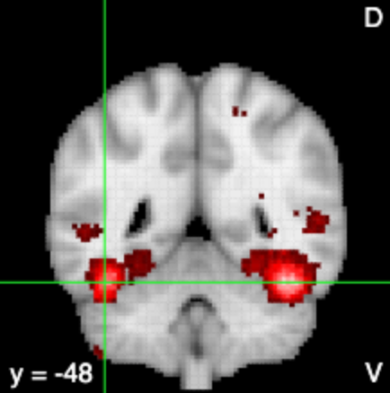
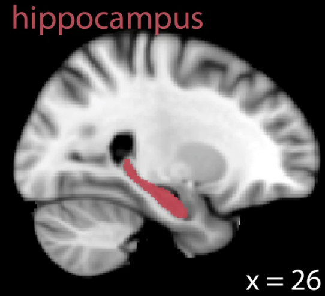
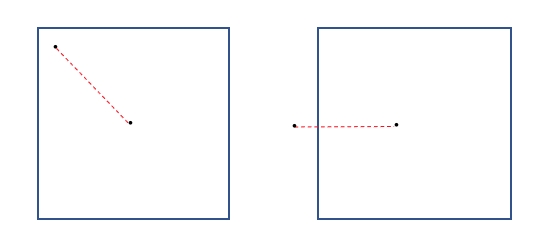
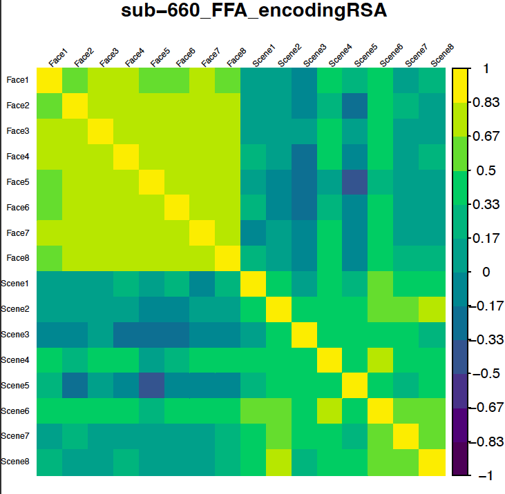
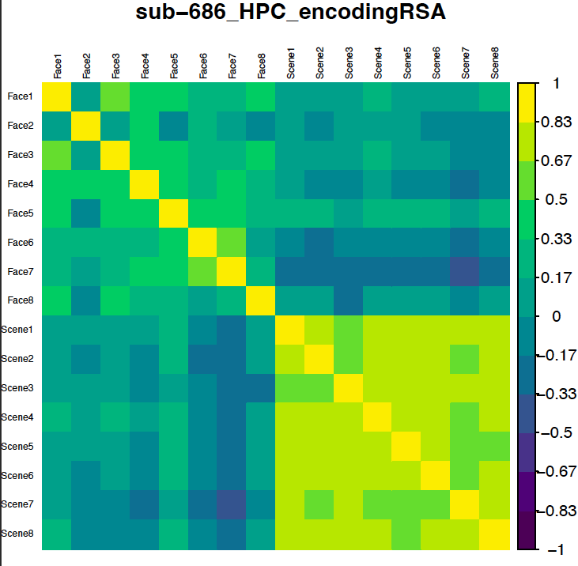
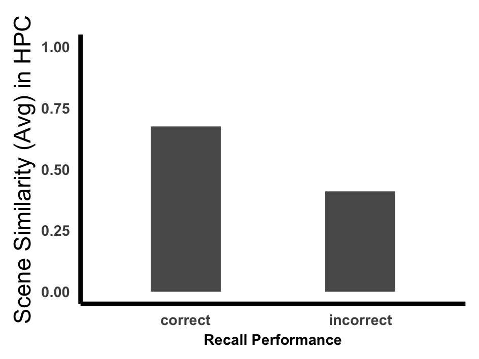
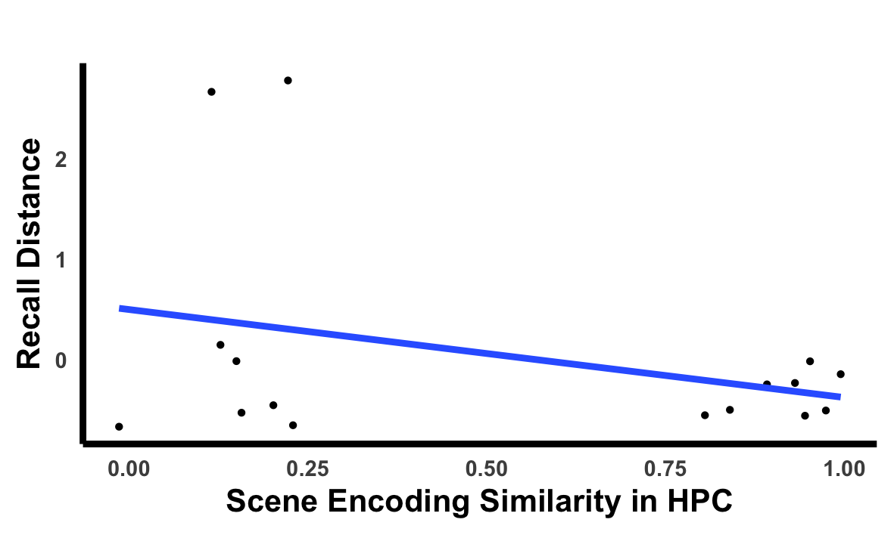

----- NOTES ----- 

| ABBREVIATIONS | VARIABLES |
| :-----------: |:---------:|
| RSA | Representational Similarity Analysis |
| RSM | Representational Similarity Matrix |
| df | Data frame |
| subID | Subject |
| ROI | Region of Interest |
| FFA | Fusiform Face Area |
| HPC | Hippocampus |
| Cor | Correlation |
| mtr | Matrix |

# Set Up

```{r setup, include=FALSE}
knitr::opts_chunk$set(echo = TRUE)
```

## Import packages
```{r, include=TRUE, cache=F}
# Load Libraries
library('haven') 
library('psych')
library('ggplot2')
library("plyr")
library("stats")
library('tidyverse')
library('corrplot') # to plot correlations
library('RColorBrewer')
library('viridis')
library('sjPlot') # for regression plots

# clear all lists in the environment
rm(list=ls())

# set display options
options(scipen=100)
options(digits=6)

```


## Define the source directory
Change this directory to where you downloaded the rsa workshop directory.
```{r Setup Directories}
sourceDir <- "/Users/haroonpopal/Desktop/COG/cog_summer_workshops_2022/rsa/"
setwd(sourceDir)

```

# Introduction to the Dataset
In a memory experiment, subjects learned images paired with a specific location on the screen. 

The workshop dataset includes imaging & behavioral data from 2 subjects from that experiment. 

For each subject, we have:

1) Their brain activity for each stimulus from two brain regions of interest (ROI): 
  - Fusiform Face Area (FFA) & Hippocampus (HPC)
    
Below are some examples to show you where these regions are, just for your reference. Please note that these are not the exact masks this data were extracted from.

FFA: This is an image from the quick ffa terms search in [neurosynth](https://neurosynth.org/analyses/terms/face%20ffa/)


HPC: This is a HPC image from a study by [Günseli & Aly (2020)](https://elifesciences.org/articles/53191) 

    
2) Their recall performance for the location of each image they learned:
  - Categorical Response/Accuracy Variable (1/0: Correct/Incorrect)
  - Continuous Distance Variable (a more precise memory performance based on how close/far they are to the target location for the image)
    


## Load and organize the data
This first part of the script organizes the data into a format to run the RSA between images

```{r, include=TRUE, cache=F}
# 1. import & clean the imaging data
s1_ffa <- read.csv('data/sub-660/ffa_l_5m_allImages_AgainstBaseline.csv')
s1_hpc <- read.csv('data/sub-660/hpc_r_5m_allImages_AgainstBaseline.csv')
s2_ffa <- read.csv('data/sub-686/ffa_l_5m_allImages_AgainstBaseline.csv')
s2_hpc <- read.csv('data/sub-686/hpc_r_5m_allImages_AgainstBaseline.csv')

# predefine subjects & ROIs  
subjects <- c("sub-660","sub-686")
rois <- c("HPC","FFA")

# lets peak into one of these datasets. Note that each row is a voxel in the given region,
# and each column is the activity from that all the voxels for a given image
# here we have 8 face images and their (face) average, and 8 scene images, and their (scene) average
# View(s1_ffa) # as a separate column or:
s1_ffa

# lets merge the two subjects together (for a group level analysis later on)
# important to note that the imaging data files don't currently have any columns to represent subject, or ROI
# we need to add them to each data frame before rbinding them together
s1_ffa$subID <- 'sub-660'
s1_ffa$ROI <- 'FFA'
s1_hpc$subID <- 'sub-660'
s1_hpc$ROI <- 'HPC'
s2_ffa$subID <- 'sub-686'
s2_ffa$ROI <- 'FFA'
s2_hpc$subID <- 'sub-686'
s2_hpc$ROI <- 'HPC'

df.fmri <- rbind(s1_ffa,s1_hpc,s2_ffa,s2_hpc)
df.fmri <- df.fmri %>% dplyr::select(subID,ROI,Face1:Scene8) # reorder & make subID & ROI first columns
  
# 2. import behavioral data
# note that the behavioral data is already merged for these two subjects
df.recall <- read.csv('data/recall.csv') 

# let's view the recall data
#View(df.recall) # as a separate column or:
df.recall

```


## Task information
In the encoding part of the task, subjects passively viewed face (or scene) images paired with a particular location on a 4X4 grid. So they are learning image-location pairings. One of our goals is to understand how similarly the varying images from a category (i.e., face) are represented in the brain, particularly in FFA and HPC. And, how whether their similar neural representations are related to how they will be remembered later.

# Within Subject, Within ROI
As a reminder we have images from face and scene categories for each subject, in each ROI. We will calculate within and between category similarities.

## Calculate Correlations
In this workshop, the representational similarity analysis will be calculated as a Pearson's correlation, so we will use the **cor** function from base R.

In the code below, we don't have any NAs. In case your data does, you can specify the function to use only the complete observations. Also note that you should only include numeric data that will be used for correlations. So here we will specify that in [] 
```{r}
# Subject-1: 
# FFA
s1_ffa_corr <- cor(s1_ffa[1:16], s1_ffa[1:16], use = "complete.obs", method = "pearson") 
head(s1_ffa_corr) # lets peak at the data

# save the correlation matrix in the results folder
write.table(data.frame(s1_ffa_corr),file="results/Sub-660_EncodingRSM_FFA.csv", quote=F,sep=",",row.names=F)

# HPC
s1_hpc_corr <- cor(s1_hpc[1:16], s1_hpc[1:16], use = "complete.obs", method = "pearson") 

# save the correlation matrix in the results folder
write.table(data.frame(s1_hpc_corr),file="results/Sub-660_EncodingRSM_HPC.csv", quote=F,sep=",",row.names=F)

```

Note that for this example, I am using Pearson correlations, but based on your needs, you may want to use other forms of correlations or distance measures. For instance, you may need to use Spearman if your data requires nonlinear fitting. Below is an example:
```{r, eval=FALSE}
s1_ffa_corr <- cor(s1_ffa[1:16], s1_ffa[1:16], use = "complete.obs", method = "spearman") 
```

Note 2: Given your unique data, you may also need to use pairwise correlations. Below is an example:
```{r, eval=FALSE}
s1_ffa_corr <- cor(s1_ffa[1:16], s1_ffa[1:16], use = "pairwise.complete.obs", method = "pearson") 
```

## Plot (& Save)
Now we'll plot the similarity matrix for our subject in one of the ROIs.
For this exercise, I will be using the **corrplot** function from the corrplot package, but you can use ggplot's [heatmap function](https://r-graph-gallery.com/79-levelplot-with-ggplot2.html) too.
``` {r}
# subject 1, FFA
s1_ffa_corr_mtr <- as.matrix(s1_ffa_corr) # turn into a matrix for heatmap

# plot
corrplot(s1_ffa_corr_mtr, method = "color", tl.srt = 45, tl.cex = 0.5, tl.col = "black", col = viridis(12), diag = T,
         title= "sub-660_FFA_encodingRSA", mar=c(0,0,1,0))

```

If you are not familiar with the corrplot function, or want to learn more about the arguments we used such as tl.srt, you can check this [page](https://cran.r-project.org/web/packages/corrplot/vignettes/corrplot-intro.htm)

We can also separately plot the within category similarity alone (i.e., just the similarity of faces or scenes) 
``` {r}
# face (within category)
corrplot(s1_ffa_corr_mtr[c(1:8),c(1:8)], method = "color", tl.srt = 45, tl.cex = 0.5, tl.col = "black", 
         col = viridis(12), diag = T, title= "sub-660_FFA_encodingRSA", mar=c(0,0,1,0))

```

We can also make the diagonal disappear by setting 'diag' argument within the plot to 'FALSE' (this will make the diagonal appear as white)
``` {r}
corrplot(s1_ffa_corr_mtr[c(1:8),c(1:8)], method = "color", tl.srt = 45, tl.cex = 0.5, tl.col = "black", 
         col = viridis(12), diag = F, title= "sub-660_FFA_encodingRSA", mar=c(0,0,1,0))

```

As you can see, the lower and upper triangle show the same information. 
We can choose either one of those for our figure by adding a 'type' argument within our corrplot function:
``` {r}
# face (within category)
corrplot(s1_ffa_corr_mtr[c(1:8),c(1:8)], method = "color", tl.srt = 45, tl.cex = 0.5, tl.col = "black", 
         type = 'lower', col = viridis(12), diag = T, title= "sub-660_FFA_encodingRSA", mar=c(0,0,1,0))

```

Finally, we can save our plot as a high quality .pdf/.png image for our presentations or publication:
``` {r}
pdf(file="figures/sub-660_FFA_encodingRSA.pdf", width=5, height=5)
p <-corrplot(s1_ffa_corr_mtr, method = "color", tl.srt = 45, tl.cex = 0.5, tl.col = "black", col = viridis(12), diag = T,
         title= "sub-660_FFA_encodingRSA", mar=c(0,0,1,0))
dev.off()

```



## Exercise-1
Now you should calculate the RSA for the second subject in HPC & plot the similarity matrices.
**Note**: The exercises in this notebook are "fill in the blank". Replace the "..."s with the correct code to complete the exercises. 

```{r, include=FALSE}


# HPC RSA
s2_hpc_corr <- cor(s2_hpc[1:16], s2_hpc[1:16], use = "complete.obs", method = "pearson") 

# save the correlation matrix in the results folder
write.table(data.frame(s2_hpc_corr),file="results/Sub-686_EncodingRSM_HPC.csv", quote=F,sep=",",row.names=F)

# plot
s2_hpc_corr_mtr <- as.matrix(s2_hpc_corr) # turn into a matrix for heat map
corrplot(s2_hpc_corr_mtr, method = "color", tl.srt = 90, tl.cex = 0.5, tl.col = "black", col = viridis(12), diag = T, title= "sub-686_HPC_encodingRSA", mar=c(0,0,1,0))

# to save the plot:
pdf(file="figures/sub-686_HPC_encodingRSA.pdf", width=5, height=5)
corrplot(s2_hpc_corr_mtr, method = "color", tl.srt = 90, tl.cex = 0.5, tl.col = "black", col = viridis(12), diag = T, title= "sub-686_HPC_encodingRSA", mar=c(0,0,1,0))
dev.off() 

```
```{r, eval=FALSE}
# Subject-2: 
# HPC RSA
s2_hpc_corr <- cor(..., ..., use = "complete.obs", method = "pearson") 

# save the correlation matrix in the results folder
write.table(data.frame(...),file="results/Sub-686_EncodingRSM_HPC.csv", quote=F,sep=",",row.names=F)

# plot
s2_hpc_corr_mtr <- as.matrix(...) # turn into a matrix for heat map
corrplot(..., method = "color", tl.srt = 90, tl.cex = 0.5, tl.col = "black", col = viridis(12), diag = T, title= "sub-686_HPC_encodingRSA", mar=c(0,0,1,0))

# Bonus! Save the plot:
pdf(file="figures/sub-686_HPC_encodingRSA.pdf", width=5, height=5)
corrplot(..., method = "color", tl.srt = 90, tl.cex = 0.5, tl.col = "black", col = viridis(12), diag = T, title= "sub-686_HPC_encodingRSA", mar=c(0,0,1,0))
dev.off()
```
[Click for solution](https://github.com/TU-Coding-Outreach-Group/cog_summer_workshops_2022/tree/main/rsa/solutions/ex1.txt)


**Example solution**


## Fisher z transform
It is always good practice to normalize all our continuous variables for statistical testing, and the correlations
we calculated for the similarity are no exception. We will use the **fisherz** function from the Psych package for this.

Note that in the example below, I am only showing one subject, one ROI, but you should do this for all your RSMs.
``` {r}
z_s1_ffa_corr <- psych::fisherz(s1_ffa_corr)
head(z_s1_ffa_corr)

```

## Bonus: Calculate similarity in Loops 
Of course in real fMRI studies, we never deal with only 2 subjects, and we are likely to have more than 2 ROIs.
So it's a good practice to learn how to do this iteratively in a loop. 

For instance, we can create the similarity matrix for both ROIs of one of our subjects (e.g., sub-660) in a loop:
``` {r}
for (nRoi in 1:length(rois)) { 
  
  # extract the data for this subject & this ROI
  df.thisroi <- subset(df.fmri, subID=="sub-660" & ROI==sprintf("%s",rois[nRoi]))
  
  #### Calculate the similarity (correlations)  ####
  # for this we'd need to make sure the data is coded as numeric.
  thisroi_rsm <- cor(df.thisroi[3:18], df.thisroi[3:18], use = "complete.obs", method = "pearson") 
  
  # Fisher z transform
  z_thisroi_rsm <- psych::fisherz(thisroi_rsm)
  
  # save the similarity matrix in the results directory (I normally save both r-, and z-versions)
  write.table(data.frame(thisroi_rsm),file=sprintf("results/sub-660_EncodingRSM_%s_r.csv",rois[nRoi]), quote=F,sep=",",row.names=F)
  
  # save Fosher z-transformed similarity matrix in the results directory
  write.table(data.frame(z_thisroi_rsm),file=sprintf("results/sub-660_EncodingRSM_%s_z.csv",rois[nRoi]), quote=F,sep=",",row.names=F)

  #### Plot & save  ####
  # first turn this data frame into a matrix for heat map
  thisroi_mtr <- as.matrix(thisroi_rsm) 
  
  pdf(file=sprintf("figures/EncodingRSM_sub-660_%s.pdf",rois[nRoi]), width=5, height=5)
  corrplot(thisroi_mtr, method = "color", tl.srt = 45, tl.cex = 0.5, tl.col = "black", col = viridis(12), diag = T,
           title= sprintf("sub-660: Encoding RSM in %s",rois[nRoi]), mar=c(0,0,1,0))
  dev.off()
  
}

```


### Exercise-2
Alternatively, for each specific ROI, we can create a loop to run all of our subjects' unique ROI RSA iteratively.

Following the example above, you should now create one such for loop for FFA
```{r, include=FALSE}
for (nSub in 1:length(subjects)) { 

      # extract the data for this subject & this ROI
      df.thisroi <- subset(df.fmri, subID==sprintf("%s",subjects[nSub]) & ROI=="FFA")
      
      #### Calculate the similarity (correlations)  ####
      # for this we'd need to make sure the data is coded as numeric.
      thisroi_rsm <- cor(df.thisroi[3:18], df.thisroi[3:18], use = "complete.obs", method = "pearson") 
      
      # Fisher z transform
      z_thisroi_rsm <- psych::fisherz(thisroi_rsm)
      
      # save the similarity matrix (r) in the results directory
      write.table(data.frame(thisroi_rsm),file=sprintf("results/%s_EncodingRSM_FFA_r.csv",subjects[nSub]), quote=F,sep=",",row.names=F)
      
      # save Fosher z-transformed similarity matrix in the results directory
      write.table(data.frame(z_thisroi_rsm),file=sprintf("results/%s_EncodingRSM_FFA_z.csv",subjects[nSub]), quote=F,sep=",",row.names=F)
      
      #### Plot & save  ####
      # first turn this data frame into a matrix for heat map
      thisroi_mtr <- as.matrix(thisroi_rsm) 

      pdf(file=sprintf("figures/EncodingRSM_%s_FFA.pdf",subjects[nSub]), width=5, height=5)
      corrplot(thisroi_mtr, method = "color", tl.srt = 45, tl.cex = 0.5, tl.col = "black", col = viridis(12), diag = T,
               title= sprintf("%s: Encoding RSM in FFA",subjects[nSub]), mar=c(0,0,1,0))
      dev.off()
      
}

```
```{r, eval=FALSE}
for (nSub in 1:length(...)) { 

      # extract the data for this subject & this ROI
      df.thisroi <- subset(... = , subID==sprintf("%s",subjects[...]) & ROI=="FFA")
      
      #### Calculate the similarity (correlations)  ####
      # for this we'd need to make sure the data is coded as numeric.
      thisroi_rsm <- ...(df.thisroi[3:18], df.thisroi[3:18], use = "complete.obs", method = "pearson") 
      
      # Fisher z transform
      z_thisroi_rsm <- psych::...(thisroi_rsm)
      
      # save the similarity matrix (r) in the results directory
      ...(data.frame(...),file=sprintf("results/%s_EncodingRSM_FFA_r.csv",subjects[nSub]), quote=F,sep=",",row.names=F)
      
      # save Fosher z-transformed similarity matrix in the results directory
      ...(data.frame(...),file=sprintf("results/%s_EncodingRSM_FFA_z.csv",subjects[nSub]), quote=F,sep=",",row.names=F)
      
      #### Plot & save  ####
      # first turn this data frame into a matrix for heat map
      thisroi_mtr <- as.matrix(...) 

      pdf(file=sprintf("figures/EncodingRSM_%s_FFA.pdf",subjects[nSub]), width=5, height=5)
      ...(thisroi_mtr, method = "color", tl.srt = 45, tl.cex = 0.5, tl.col = "black", col = viridis(12), diag = T,
               title= sprintf("%s: Encoding RSM in FFA",subjects[nSub]), mar=c(0,0,1,0))
      dev.off()
      
}

```
[Click for solution](https://github.com/TU-Coding-Outreach-Group/cog_summer_workshops_2022/blob/main/rsa/solutions/ex2.txt)


### Exercise-3
I am sure you guessed where this is going: We can merge all the previous steps together in a nested loop. 

Bonus: We could save the similarity matrix from each iteration into a master data set, which we will later
be useful for relating the encoding similarity to behavioral performance.

PS: To keep this loop simple, let's only calculate & save the r-values, but we could always adapt this later 
to save z-values or both r- and z-transformed correlations.

```{r}
# Create an empty data frame. I will provide it here to get you started, but you should make sure to 
# assign similarity values to this data frame in your loop.
masterdata <- data.frame(subID = character(), ROI = character(), Trials = character(), 
                         stringsAsFactors = FALSE) 
```

```{r, eval=FALSE}
# for the loop, we will use the data frame we created with all the subject/roi information
# create the empty master dataset
nRow <-1

for (nSub in 1:length(...)) { 
  
  for (nRoi in 1:length(...)) { 
    
      # extract the data for this subject & this ROI
      df.thisroi <- subset(df.fmri, subID==sprintf("%s",subjects[nSub]) & ROI==sprintf("%s",rois[nRoi]))
      
      #### Calculate the similarity (correlations)  ####
      # for this we'd need to make sure the data is coded as numeric.
      thisroi_rsm <- ...(df.thisroi[3:18], df.thisroi[3:18], use = "complete.obs", method = "pearson") 

      # save the similarity matrix in the results directory
      ...(data.frame(thisroi_rsm),file=sprintf("results/%s_EncodingRSM_%s.csv",subjects[nSub],rois[nRoi]), quote=F,sep=",",row.names=F)
      
      #### Plot & save  ####
      # first turn this data frame into a matrix for heat map
      thisroi_mtr <- ...(thisroi_rsm) 

      pdf(file=sprintf("figures/EncodingRSM_%s_%s.pdf",subjects[nSub],rois[nRoi]), width=5, height=5)
      corrplot(thisroi_mtr, method = "color", tl.srt = 45, tl.cex = 0.5, tl.col = "black", col = viridis(12), diag = T,
               title= sprintf("%s: Encoding RSM in %s",subjects[nSub],rois[nRoi]), mar=c(0,0,1,0))
      dev.off()
      
      #### Save this similarity matrix into the master data together with subject/roi information ####
      masterdata[c(nRow:(nRow+nrow(thisroi_rsm)-1)),c(1:3)] <- cbind(matrix(rep(subjects[nSub],length.out=nrow(thisroi_rsm))), # repeat the subject name
                                                               matrix(rep(rois[nRoi],length.out=nrow(thisroi_rsm))),
                                                               row.names(thisroi_rsm)) # get the similarity between images
      
      masterdata[c(nRow:(nRow+nrow(thisroi_rsm)-1)),c(4:19)] <- thisroi_rsm # get the similarity between images
      
      # increase nRow by total row numbers of thisroi_rsm to correctly save info from the next iteration
      nRow <- ... + nrow(thisroi_rsm)
        
  }
}

# finally name columns for similarity values: since these are same as the row names, we can directly copy them over.  
names(masterdata)[4:19] <- row.names(thisroi_rsm)

# save the master dataset as is
write.table(data.frame(masterdata),file="results/AllSubjects_AllROIs_EncodingRSM.csv", quote=F,sep=",",row.names=F)
```
```{r, include=FALSE}
# for the loop, we will use the data frame we created with all the subject/roi information
# create the empty master dataset
nRow <-1

for (nSub in 1:length(subjects)) { 
  
  for (nRoi in 1:length(rois)) { 
    
      # extract the data for this subject & this ROI
      df.thisroi <- subset(df.fmri, subID==sprintf("%s",subjects[nSub]) & ROI==sprintf("%s",rois[nRoi]))
      
      #### Calculate the similarity (correlations)  ####
      # for this we'd need to make sure the data is coded as numeric.
      thisroi_rsm <- cor(df.thisroi[3:18], df.thisroi[3:18], use = "complete.obs", method = "pearson") 

      # save the similarity matrix in the results directory
      write.table(data.frame(thisroi_rsm),file=sprintf("results/%s_EncodingRSM_%s.csv",subjects[nSub],rois[nRoi]), quote=F,sep=",",row.names=F)
      
      #### Plot & save  ####
      # first turn this data frame into a matrix for heat map
      thisroi_mtr <- as.matrix(thisroi_rsm) 

      pdf(file=sprintf("figures/EncodingRSM_%s_%s.pdf",subjects[nSub],rois[nRoi]), width=5, height=5)
      corrplot(thisroi_mtr, method = "color", tl.srt = 45, tl.cex = 0.5, tl.col = "black", col = viridis(12), diag = T,
               title= sprintf("%s: Encoding RSM in %s",subjects[nSub],rois[nRoi]), mar=c(0,0,1,0))
      dev.off()
      
      #### Save this similarity matrix into the master data together with subject/roi information ####
      masterdata[c(nRow:(nRow+nrow(thisroi_rsm)-1)),c(1:3)] <- cbind(matrix(rep(subjects[nSub],length.out=nrow(thisroi_rsm))), # repeat the subject name
                                                               matrix(rep(rois[nRoi],length.out=nrow(thisroi_rsm))),
                                                               row.names(thisroi_rsm)) # get the similarity between images
      
      masterdata[c(nRow:(nRow+nrow(thisroi_rsm)-1)),c(4:19)] <- thisroi_rsm # get the similarity between images
      
      # increase nRow by total row numbers of thisroi_rsm to correctly save info from the next iteration
      nRow <- nRow + nrow(thisroi_rsm)
        
  }
}

# finally name columns for similarity values: since these are same as the row names, we can directly copy them over.  
names(masterdata)[4:19] <- row.names(thisroi_rsm)

# save the master dataset as is
write.table(data.frame(masterdata),file="results/AllSubjects_AllROIs_EncodingRSM.csv", quote=F,sep=",",row.names=F)
```
[Click for solution](https://github.com/TU-Coding-Outreach-Group/cog_summer_workshops_2022/blob/main/rsa/solutions/ex3.txt)


# Within Group
Not all research is about individuals. You may want to run a group-level similarity within your ROI. That is, instead of calculating encoding similarity for each of your subjects separately, you may want to see how your group is doing on average.

This means that we will include all the voxels from both our subjects when we are calculating the RSMs.

Let's do one example for FFA together:
```{r}
# just to make sure, we should empty the previously used arrays/frames
df.thisroi <- NA
thisroi_rsm <- NA
thisroi_mtr <- NA

# extract the data for this subject & this ROI
df.thisroi <- subset(df.fmri, ROI=="FFA")

#### calculate the similarity (correlations)  #### 
# for this we'd need to make sure the data is coded as numeric.
thisroi_rsm <- cor(df.thisroi[3:18], df.thisroi[3:18], use = "complete.obs", method = "pearson") 

# save the similarity matrix in the results directory
write.table(data.frame(thisroi_rsm),file=sprintf("results/GroupLevel_EncodingRSM_%s.csv",rois[nRoi]), quote=F,sep=",",row.names=F)

####  plot  ####  
# first turn this data frame into a matrix for heat map
thisroi_mtr <- as.matrix(thisroi_rsm) 

corrplot(thisroi_mtr, method = "color", tl.srt = 90, tl.cex = 0.5, tl.col = "black", col = viridis(12), diag = T, title= sprintf("Group Level Encoding RSM in %s",rois[nRoi]), mar=c(0,0,1,0))

```

Please note that even with the addition of another subject's data, we get stronger correlations!

Again we can put this into loop to run all our ROIs, we will not really go over it but you can check the code below: 
```{r}
# just to make sure, we should empty the previously used arrays/frames
df.thisroi <- NA
thisroi_rsm <- NA
thisroi_mtr <- NA

for (nRoi in 1:length(rois)) { 

  # extract the data for this subject & this ROI
  df.thisroi <- subset(df.fmri, ROI==sprintf("%s",rois[nRoi]))
  
  #### calculate the similarity (correlations)  #### 
  # for this we'd need to make sure the data is coded as numeric.
  thisroi_rsm <- cor(df.thisroi[3:18], df.thisroi[3:18], use = "complete.obs", method = "pearson") 
  
  # save the similarity matrix in the results directory
  write.table(data.frame(thisroi_rsm),file=sprintf("results/GroupLevel_EncodingRSM_%s.csv",rois[nRoi]), quote=F,sep=",",row.names=F)
  
  ####  plot & save  ####  
  # first turn this data frame into a matrix for heat map
  thisroi_mtr <- as.matrix(thisroi_rsm) 
  
  pdf(file=sprintf("figures/EncodingRSM_GroupLevel_%s.pdf",rois[nRoi]), width=5, height=5)
  corrplot(thisroi_mtr, method = "color", tl.srt = 45, tl.cex = 0.5, tl.col = "black", col = viridis(12), diag = T,
           title= sprintf("Group Level Encoding RSM in %s",rois[nRoi]), mar=c(0,0,1,0))
  dev.off()
  
}

```


# ROI RSA Predicting Behavior (Memory)
It's up to us, the researchers, to decide how to relate the similarity data to the behavioral data. Depending on your question, you may want to correlate behavioral data to your neural similarity matrix. If you are interested in this option, you can check a previous [workshop run by Iva Brunec](https://github.com/TU-Coding-Outreach-Group/cog_summer_workshops_2020/blob/master/representational-similarity-analysis/COG_RSA_workshop.ipynb) in our group for some examples .


---

Alternatively, you may need to predict behavioral outcome from the similarity matrix you created, or you may predict the similarity from some behavioral index.

In this research, my question is whether the encoding similarity between studied images predict memory for the same images in a future memory test. So I want to run regression analyses with the similarity data as my predictor, while the behavioral data (memory recall) will be my outcome variable.

To get us started, I will first merge the behavioral recall data with the neural similarity RSMs we created
``` {r, include=FALSE}
df.merged <- merge(df.recall, masterdata, by=c('subID','Trials'))

# let's peak into this newly merged dataset
df.merged

```


OUTCOME VARIABLE: RECALL PERFORMANCE
I can think of several different ways to organize my outcome variable: 

1. I have obtained an accuracy (correct vs incorrect) response for each studied image, and I could use that categorical variableas the outcome (dependent) variable. 

2. I have a continuous assessment of the precise spatial location of each image as the subjects remember them. I can use this variable (distance) as my outcome variable for an item level analysis.


PREDICTOR VARIABLE: ENCODING SIMILARITY
How you think of similarity as a predictor depends on your question, and the type of analysis you'd like to test. Here I am curious to see if an image's similarity to other within category members is important in remembering that image (i.e., according to interference theories, the more similar the images, the more confusing they are, hence harder to remember)

So, I'd like to get an 'average' similarity assessment for each of my images (i.e., how similar is one face image to the other face images on average?). For this, I can get the mean of an image's similarity to all other images in it's category. 

I will create these 'average similarities' for each image within each ROI, for each subject

While we are getting the average similarities for each image, we will also obtain an image's similarity to the other category images too. For instance, for Face1, we will create it's average similarity to all other face images (within category similarity), and its average similarity to all scene images (across category similarity).

``` {r}
categories <- c('face','scene') 

# create a within/across category average similarity variable; these will be average similarity of 1 image to
# the other images in its own category & the other category (will be calculated for each image separately)
df.merged$AvgSimilarity2OtherFaces <- NA
df.merged$AvgSimilarity2OtherScenes <- NA

for (nSub in 1:length(subjects)) {
  for (nRoi in 1:length(rois)) { 
    for (nCat in 1:2) {
      
      # extract the data for this subject & this ROI
      df.subset <- subset(df.merged, subID == sprintf("%s",subjects[nSub]) & ROI==sprintf("%s",rois[nRoi]) &
                            Category == sprintf("%s", categories[nCat]))
      
      # depending on whether it is the face or scene images, the within vs across category avg similarity will be
      # calculated differently; so I will create an if loop to control these calculations:
      
      if (nCat ==1) { # if it is the face category
        for (nTrial in 1:8) { # loop from trial1 to trial8 within this category
          
          # Within Category Similarity (to Faces):
          # An easy way to calculate average within category similarity for each image is to sum its similarities to
          # all 8 images from that category. This would include its similarity to itself (1), so we need to subtract 1 
          # from this sum, then finally divide it by [(nTrials=8)-1=7]
          df.subset[nTrial,29] <- (rowSums(df.subset[nTrial, c(13:20)])-1)/7
          
          # Across Category Similarity (to Scenes)
          df.subset[nTrial,30] <- (rowSums(df.subset[nTrial, c(21:28)]))/8
          
        }
        
        # Finally assign these average similarities to the df.merged dataset to assign the correct values
        # to correct rows, we will use the rownames function in base R for indexing
        df.merged[rownames(df.subset),29:30] <- df.subset[,29:30]
        
      } else if (nCat ==2) { # if it is the scene category
        for (nTrial in 1:8) { # loop from trial1 to trial8 within this category
          
          # Within Category Similarity (to Scenes)
          # An easy way to calculate average within category similarity for each image is to sum its similarities to
          # all 8 images from that category. This would include its similarity to itself (1), so we need to subtract 1 
          # from this sum, then finally divide it by [(nTrials=8)-1=7]
          df.subset[nTrial,30] <- (rowSums(df.subset[nTrial, c(21:28)])-1)/7
          
          # Across Category Similarity (to Faces)
          df.subset[nTrial,29] <- (rowSums(df.subset[nTrial, c(13:20)]))/8
        }
        
        # Finally assign these average similarities to the df.merged dataset
        # to assign the correct values to correct rows, we will use the rownames function in base R for indexing
        df.merged[rownames(df.subset),29:30] <- df.subset[,29:30]
        
      }
    }
  }
}

```


Let's now organize our new variables before statistical testing: 
``` {r}
# factorize the categorical outcome variable
df.merged$Response <- as.factor(df.merged$Response)

# Fisher z transform the average correlations
df.merged$zAvgSimilarity2OtherFaces <- psych::fisherz(df.merged$AvgSimilarity2OtherFaces)
df.merged$zAvgSimilarity2OtherScenes <- psych::fisherz(df.merged$AvgSimilarity2OtherScenes)

# normalize the distance variable
df.merged$sDistance <- scale(df.merged$Distance)

```


## Predicting Item Accuracy from Average Within Category Similarity (Categorical)
We will first test a prediction that an image's similarity to its category will be related to
whether or not it will be correctly recalled.

Since our outcome variable is categorical (correct (1) vs incorrect(0)), we will fit a nonlinear (binomial) model 

Let's run one example model for average face similarity in FFA predicting recall performance
Remember that we are now using z-standardized similarity values for our statistical tests!
``` {r}
face_ffa_itemAcc <- glm(Response ~ zAvgSimilarity2OtherFaces, data = subset(df.merged, ROI == "FFA" & Category=="face"), 
                        family = "binomial")
summary(face_ffa_itemAcc)

```

Plot
``` {r}
# Note that we are plotting the actual data, not the model predictions, below. Also, we are using the Accuracy
# variable instead of the Response variable to plot the correct/incorrect response options instead of 0/1.
p_face_ffa_itemAcc <- ggplot(data=subset(df.merged, ROI == "FFA" & Category=="face"), 
                             aes_string(x="Accuracy", y="zAvgSimilarity2OtherFaces")) + 
  geom_bar(stat="summary", fun="mean", width=.4, position="dodge") + theme_minimal() +
  labs(x="Recall Performance", y="Face Similarity (Avg) in FFA", title="") +
  theme(plot.title = element_text(face = "bold", size = 6), axis.text.y = element_text(size = 7, face ="bold"),
        axis.text.x = element_text(size = 7, face ="bold"), axis.title.x = element_text(size = 7, face = "bold"),
        axis.line = element_line(size = 1, colour = "black"),panel.grid = element_blank(), legend.title = element_blank(), 
        legend.position = "top", legend.text = element_text(size = 7, face = "bold"), aspect.ratio=0.7) +
  scale_y_continuous(limits = c(0,1))

# save the plot
ggsave(p_face_ffa_itemAcc, file="figures/Face_Accuracy_by_EncodingRSM_in_FFA.png",width=8, height=6, units="cm")

# view the plot
p_face_ffa_itemAcc

```


### Exercise-4
Test scene similarity in HPC in relation to recall accuracy
```{r, include=FALSE}
# test the model
scene_hpc_itemAcc <- glm(Response ~ zAvgSimilarity2OtherScenes, data = subset(df.merged, ROI == "HPC" & Category=="scene"), 
                        family = "binomial")
summary(scene_hpc_itemAcc)


# plot 
p_scene_hpc_itemAcc <- ggplot(data=subset(df.merged, ROI == "HPC" & Category=="scene"), 
            aes_string(x="Accuracy", y="zAvgSimilarity2OtherScenes")) + 
  geom_bar(stat="summary", fun="mean", width=.4, position="dodge") + theme_minimal() +
  labs(x="Recall Performance", y="Scene Similarity (Avg) in HPC", title="") +
  theme(plot.title = element_text(face = "bold", size = 6), axis.text.y = element_text(size = 7, face ="bold"),
        axis.text.x = element_text(size = 7, face ="bold"), axis.title.x = element_text(size = 7, face = "bold"),
        axis.line = element_line(size = 1, colour = "black"),panel.grid = element_blank(), legend.title = element_blank(), 
        legend.position = "top", legend.text = element_text(size = 7, face = "bold"), aspect.ratio=0.7) +
  scale_y_continuous(limits = c(0,1))

# save the plot
ggsave(p_scene_hpc_itemAcc, file="figures/Scene_Accuracy_by_EncodingRSM_in_HPC.png", width=8, height=6, units="cm")

# view the plot
p_scene_hpc_itemAcc
```
```{r, eval=FALSE}
# test the model
scene_hpc_itemAcc <- glm(... ~ ..., data = subset(df.merged, ROI == "HPC" & Category=="scene"), 
                        family = "binomial")
summary(scene_hpc_itemAcc)


# plot 
p_scene_hpc_itemAcc <- ggplot(data=subset(..., ROI == "HPC" & Category=="scene"), 
            aes_string(x="Accuracy", y="zAvgSimilarity2OtherScenes")) + 
  geom_bar(stat="summary", fun="mean", width=.4, position="dodge") + theme_minimal() +
  labs(x="Recall Performance", y="Scene Similarity (Avg) in HPC", title="") +
  theme(plot.title = element_text(face = "bold", size = 6), axis.text.y = element_text(size = 7, face ="bold"),
        axis.text.x = element_text(size = 7, face ="bold"), axis.title.x = element_text(size = 7, face = "bold"),
        axis.line = element_line(size = 1, colour = "black"),panel.grid = element_blank(), legend.title = element_blank(), 
        legend.position = "top", legend.text = element_text(size = 7, face = "bold"), aspect.ratio=0.7) +
  scale_y_continuous(limits = c(0,1))

# save the plot
ggsave(..., file="figures/Scene_Accuracy_by_EncodingRSM_in_HPC.png", width=8, height=6, units="cm")

# view the plot
...
```
[Click for solution](https://github.com/TU-Coding-Outreach-Group/cog_summer_workshops_2022/blob/main/rsa/solutions/ex4.txt)

**Example solution**



## Predicting Recall Precision from Within Category Similarity (Item Level) 
We will now test a prediction that an image's similarity to its category will be related to how well (precisely) its location will be remembered. In this exercise, our outcome (distance) variable is a continuous variable, so we will fit a linear model using the lm function. As a reminder, we have already z-scored it in the beginning of this section.

Example: Face similarity in FFA
``` {r}
face_ffa_itemDist <- lm(sDistance ~ zAvgSimilarity2OtherFaces, data = subset(df.merged, ROI == "FFA" & Category=="face"))
summary(face_ffa_itemDist)

```

Plot
``` {r}
p_face_ffa_itemDist <- ggplot(data=subset(df.merged, ROI=="FFA" & Category =="face"),
                               aes_string(x="zAvgSimilarity2OtherFaces",y="sDistance")) +
  geom_point(size=0.5) + geom_smooth(method=lm, se=FALSE, fullrange=FALSE, level=0.95) +
  theme_minimal() + labs(x="Face Encoding Similarity in FFA", y="Recall Distance", title="") +
  theme(plot.title = element_text(face = "bold", size=10), axis.text.y = element_text(face = "bold", size=7),
        axis.title.x = element_text(face = "bold", size=10), axis.title.y = element_text(face = "bold", size=10),
        axis.text.x = element_text(face = "bold", size=7), axis.line = element_line(size = 1, colour = "black"),
        panel.grid = element_blank(), legend.text = element_text(size = 5, face = "bold"))
# save the plot
ggsave(p_face_ffa_itemDist, file=paste0("figures/RecallDistance_by_FaceEncodingRSM_FFA.png"), width=10, height=6, units="cm") 

# view the plot
p_face_ffa_itemDist 

```

### Exercise-5
Test scene similarity in HPC in relation to recall distance
```{r, include=FALSE}
# test the model
scene_hpc_itemDist <- lm(sDistance ~ zAvgSimilarity2OtherScenes, data = subset(df.merged, ROI == "HPC" & Category=="scene"))
summary(scene_hpc_itemDist)

# plot
p_scene_hpc_itemDist <- ggplot(data=subset(df.merged, ROI=="HPC" & Category =="scene"),
                               aes_string(x="zAvgSimilarity2OtherScenes",y="sDistance")) +
  geom_point(size=0.5) + geom_smooth(method=lm, se=FALSE, fullrange=FALSE, level=0.95) +
  theme_minimal() + labs(x="Scene Encoding Similarity in HPC", y="Recall Distance", title="") +
  theme(plot.title = element_text(face = "bold", size=10), axis.text.y = element_text(face = "bold", size=7),
        axis.title.x = element_text(face = "bold", size=10), axis.title.y = element_text(face = "bold", size=10),
        axis.text.x = element_text(face = "bold", size=7), axis.line = element_line(size = 1, colour = "black"),
        panel.grid = element_blank(), legend.text = element_text(size = 5, face = "bold"))

# save the plot
ggsave(p_scene_hpc_itemDist, file=paste0("figures/RecallDistance_by_SceneEncodingRSM_HPC.png"), width=10, height=6, units="cm") 

# view the plot
p_scene_hpc_itemDist 

```
```{r, eval=FALSE}
# test the model
scene_hpc_itemDist <- lm(... ~ ...length(), data = subset(df.merged, ROI == "..." & Category=="..."))
summary(scene_hpc_itemDist)

# plot
p_scene_hpc_itemDist <- ggplot(data=subset(df.merged, ROI=="..." & Category =="..."),
                               aes_string(x="zAvgSimilarity2OtherScenes",y="sDistance")) +
  geom_point(size=0.5) + geom_smooth(method=lm, se=FALSE, fullrange=FALSE, level=0.95) +
  theme_minimal() + labs(x="Scene Encoding Similarity in HPC", y="Recall Distance", title="") +
  theme(plot.title = element_text(face = "bold", size=10), axis.text.y = element_text(face = "bold", size=7),
        axis.title.x = element_text(face = "bold", size=10), axis.title.y = element_text(face = "bold", size=10),
        axis.text.x = element_text(face = "bold", size=7), axis.line = element_line(size = 1, colour = "black"),
        panel.grid = element_blank(), legend.text = element_text(size = 5, face = "bold"))

# save the plot
ggsave(p_scene_hpc_itemDist, file=paste0("figures/RecallDistance_by_SceneEncodingRSM_HPC.png"), width=10, height=6, units="cm") 

# view the plot
p_scene_hpc_itemDist 

```
[Click for solution](https://github.com/TU-Coding-Outreach-Group/cog_summer_workshops_2022/blob/main/rsa/solutions/ex5.txt)

**Example Solution**

